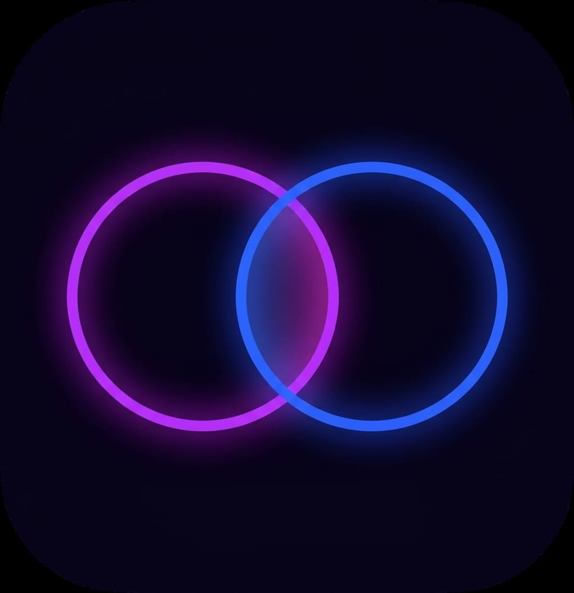

# Pupa

<p align="center">
  
</p>

App Android de autodisciplina para uso personal. Detecta uso excesivo de redes sociales, fuerza escala de grises y penaliza YouTube Shorts.

Diseñada para Samsung S24, nunca publicada en Play Store. Se instala directo desde Android Studio.

---

## Features

### 1. Timer de 15 minutos con bloqueo diario

Monitorea Instagram, Chrome y TikTok. Si pasás 15 minutos continuos en cualquiera de esas apps:

- Te saca al home y bloquea la app por el resto del día
- Si intentás reabrirla, suena un audio random a volumen máximo
- A medianoche se desbloquea automáticamente
- El timer solo cuenta con la pantalla encendida

### 2. Escala de grises permanente

El teléfono está siempre en blanco y negro, excepto en apps donde el color importa: Galería, Cámara, WhatsApp, Maps, Waze, Netflix, YouTube y Crunchyroll.

Si desactivás el grayscale manualmente desde ajustes, se vuelve a activar solo.

### 3. YouTube: forzar horizontal + penalizar Shorts

Al abrir YouTube se fuerza modo landscape. Si entrás a Shorts (que fuerza portrait), se activa grayscale y arranca un timer de 15 minutos que al expirar reproduce un sonido de castigo.

Al salir de Shorts se restaura el color y se cancela el timer.

---

## Cómo funciona

El motor es un `AccessibilityService` que escucha cambios de ventana (`TYPE_WINDOW_STATE_CHANGED`). Cada vez que cambia la app en primer plano, despacha las tres features.

Diseño completamente event-driven: sin polling, sin WakeLock, sin permisos de red. Impacto en batería mínimo.

---

## Stack

- Kotlin nativo, sin coroutines (usa `Handler`)
- `minSdk 29`, `targetSdk 34`
- Sin librerías externas, solo AndroidX
- View Binding

---

## Sonidos

La app tiene una biblioteca de sonidos de castigo. Se pueden importar de dos formas:

- Desde la app con el botón **+ Agregar**
- Compartiendo un audio desde WhatsApp u otra app

Soporta mp3, m4a, wav, ogg, opus y aac. Los sonidos se reproducen con `USAGE_ALARM` para que suenen aunque el teléfono esté en silencio.

---

## Setup

Requiere permisos especiales que no se pueden otorgar desde la app:

```bash
# Otorgar WRITE_SECURE_SETTINGS por ADB (una sola vez)
adb shell pm grant com.personal.selfcontrol android.permission.WRITE_SECURE_SETTINGS
```

Después desde el teléfono:

1. Ajustes > Accesibilidad > Apps instaladas > **Pupa Monitor** > Activar
2. Desde la app: **Modificar ajustes del sistema** > Activar
3. Desde la app: **Optimización de batería** > Sin restricciones
